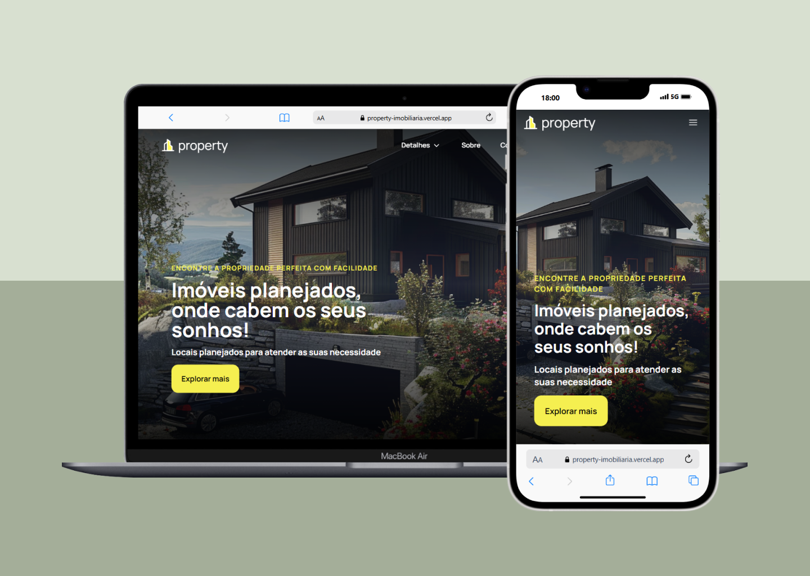

# Property Imobiliária - Site Institucional e Catálogo de Imóveis

<div align="center">
<a href="https://property-imobiliaria.vercel.app/">

</a>
<p><a href="https://property-imobiliaria.vercel.app/">
Visualizar Prévia
</a></p>
</div>

Este é um projeto de portfólio que apresenta a Property Imobiliária, uma organização fictícia especializada em aluguel e venda de propriedades. A plataforma oferece uma experiência moderna e interativa para os usuários conhecerem os serviços, sua equipe, áreas de atuação e imóveis disponíveis.


## 🚀 Tecnologias Utilizadas

- [Next.js](https://nextjs.org/) - Framework React
- [TypeScript](https://www.typescriptlang.org/) - Superset JavaScript com tipagem estática
- [Tailwind CSS](https://tailwindcss.com/) - Framework CSS
- [Zustand](https://zustand-demo.pmnd.rs/) - Gerenciamento de estado
- [Axios](https://axios-http.com/) - Cliente HTTP
- [Framer Motion](https://www.framer.com/motion/) - Animações
- [React Hot Toast](https://react-hot-toast.com/) - Notificações
- [Headless UI](https://headlessui.com/) - Componentes UI acessíveis
- [Stripe](https://stripe.com/) - Processamento de pagamentos e vendas

## 📋 Pré-requisitos

- Node.js (versão 18 ou superior)
- npm ou yarn
- Conta no Stripe para processamento de pagamentos

## 🔧 Instalação

1. Clone o repositório:
```bash
git clone https://github.com/seu-usuario/imobiliaria.git
cd imobiliaria
```

2. Instale as dependências:
```bash
npm install
# ou
yarn install
```

3. Configure as variáveis de ambiente:
Crie um arquivo `.env` na raiz do projeto com as seguintes variáveis:
```env
NEXT_PUBLIC_API_URL=sua_url_api
STRIPE_SECRET_KEY=sua_chave_secreta_stripe
NEXT_PUBLIC_STRIPE_PUBLISHABLE_KEY=sua_chave_publica_stripe
```

## 🚀 Executando o projeto

Para iniciar o servidor de desenvolvimento:

```bash
npm run dev
# ou
yarn dev
```

O projeto estará disponível em [http://localhost:3000](http://localhost:3000)

## 📦 Scripts Disponíveis

- `npm run dev` - Inicia o servidor de desenvolvimento
- `npm run build` - Cria a versão de produção
- `npm run start` - Inicia o servidor de produção
- `npm run lint` - Executa a verificação de código

## 🏗️ Estrutura do Projeto

```
imobiliaria/
├── app/              # Páginas e rotas da aplicação
├── components/       # Componentes React reutilizáveis
├── actions/         # Funções de ações do servidor
├── hooks/           # Hooks personalizados
├── lib/             # Utilitários e configurações
├── providers/       # Provedores de contexto
├── public/          # Arquivos estáticos
└── types.ts         # Definições de tipos TypeScript
```

## 👥 Contribuição

Contribuições são sempre bem-vindas! Por favor, leia o guia de contribuição antes de enviar um pull request.
